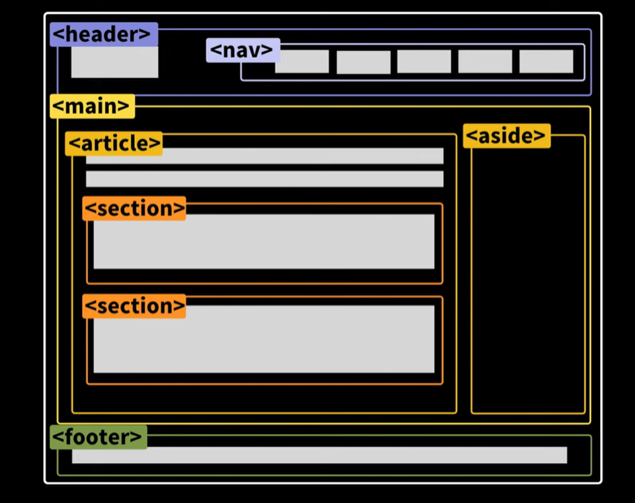

# Web Applicaation Architecture
## Client
- User & Web browser
- URL을 통해 Server에 접근 요청
    - `http://<server IP>:<port Number>/<resource>`
    - `https` : 보안 관련 protocol
## Server
- 일반적으로 사용하는 web server를 지칭
    - Apache, Ngix
    - VSC의 Live server를 통한 구현 가능
- 작성된 HTML 내에 CSS, JS 삽입
    - HTML, CSS, JS : Static programming language
        - HTML : Data framework
        - Javascript, DOM : Design & dynamic control

### WAS : Web Application Server
- Web Server와 Container를 포함
    - Container : dynamic file 처리
        - Django, jsp,servlet, C#, ASP 
            - Dynamic file
                - 요청된 파일이 있는 경우, HTML로 실행
                - 실행 시점에 따라 다른 결과 제공 가능

## Process
1. Request from a Client to a Server with URLs
2. Search a.html
    - Error codes
        - 404 : Not found (a.html does not exist)
        - 200 : Loading successful
3. Pass a.html from the server to the client
4. Save a.html on the client
5. Rendering a.html(incl. CSS, JS) on the client

## HTML
- Hyper Text Markup Language
    - Hyper Text : Text 내 hyper link 설정 가능
    - Markup : Tag로 구성되어 문서의 내용을 표시
        - Start/End tag로 구성
        - Tag 내 body에 tag 중첩 가능
        - Tag 내 복수 attribute 삽입 가능
            - `key="value"`(Attribute_name = Attribue)
                - `value`에는 double quotation 적용 필수
        - `<tag/>` : empty tag
            - body를 갖지 않는 tag를 표현
        - `<!-annotation-->`: annotation 표현 방식
- DOCTYPE Declartion
    - Web browser에서의 정확한 rendering을 위한 선언
    - HTML5 : `<!DOCTYPE html>`
- DOM : Document Object Model
    - HTML 문서의 tag에 해당되는 object를 생성, tree로 구성

    - Browser memory에 생성 후 rendering 실행
    - Node
        - Element node : Tag
        - Attribute node : Attribute
        - Text node : Text
    - Node간의 관계
        - `parentNode` : 부모 노드
        - `childNodes` : 자식 노드 리스트
        - `firstChild` : 첫번째 자식 노드
        - `lastChild` : 마지막 자식 노드가 
        - `nextSibling` : 현재노드의 다음 형제 노드를 반환한다.
        - `previousSibling` : 현재 노드의 이전 형제 노드를 반환한다.

## JavaScript
- `<script>` tag를 명시하여 사용
- Internal use
    ```html
    <script> </script>
    ```
- External use
    ```html
    <script src="file_path"></script>
    ```

## HTML tag
- `<meta>` : web page 관련 추가 정보 제공
- `<base>` : 문서 내 모든 link의 기본 주소 및 target 명시
    - 반드시 `<head>` tag 영역 내 사용
    - 단일 문서 내 중복 사용 불가
    ```html
    <base href="path" target="_blank">
    ```
    - `target` : link의 동작 방식 선언
        - `"_blank"` : 새로운 page/tab에서 open
        - `"_self"` : default. 현재 page/tab에서 open
        - `"_parent"` : parent frame에서 open
        - `"_top"` : 현재 window에서 전체화면으로 open
- `<title>` : web page title 제공
- `<script>` : web page 내 java script 명시
- `<link>` : web page 내 파일 추가
    ```html
    <link rel="stylesheet" type="text/css" href="css/mystyle.css">
    <link rel="icon" type="images/icon" href="images/favicon.ico">
    ```
    - favicon : web browser의 주소창에 표시되는 대표 icon
- `<style>` : HTML의 style 지정
    - 일반적으로 내부 CSS 파일 지정 시 사용
        ```html
        <style type="text/css">
        p{
            color:red;	
        }
        ```
- `<h1>` : header tag
    - `<h1>` ~ `<h6>`까지 제공
- `<hr>` : page 내 수평선 생성을 통한 내용 분리
    ```html
    <hr/>
    <hr size="n" width="m" noshade />
    <hr size="n" width="m" noshade="noshade" />
    ```
    - size, width, shade 지정 가능
    - No end tag
- `<p>` : paragraph 지정 시 사용
    - 여백 생성 및 내용 분리 목적 사용 지양
- `<br>` : new line 생성 시 사용
    - No end tag
- `<a>` : 타 web page 혹은 특정 위치에 대한 bookmark 삽입 (anchor tag)
    - target 속성 지정 가능
    - `id` 생성 후, `href`를 통한 이동 지점 지정
        - 타 html의 point 지정 가능
    ```html
    <a id="point"> text </a>
    <a href="#point"> to text </a>
    <a href="test.html#point"> to other html's point </a>
    <a href="test.html#point" target="_self"> to other html's point </a>
    ```
- `<table border="n">` : 테이블 생성 시 사용
    - `border="n"` : size n의 outline 지정
    - `<thead>` : header content grouping
    - `<tr>` : table row tag
    - `<th>` : header cell tag
    - `<td>` : data cell tag
        - data cell 내에 nested table 및 list 생성 가능
    - `<tfoot>` : footer content grouping
        - 반드시 `<tbody>` 앞에 사용
    - `<tbody>` : body contenct grouping
    - `rowsapn`, `colspan` : n개 cell merge
        - `colspan="n"` : n개 column merge
        - `rowspan="n"` : n개 row merge
        - 
        ```html
        <tr colspan="n">text</tr>
        <tr rowspan="n">text</tr>
        ```
- `<ol>` : ordered list
    - `start="n"` : start num 지정
- `<ul>` : unordered list
    - `type="circle|square|disc"` : list type 지정
- Text format tags
    - `<b>`: bold
    - `<i>`: italic formatting
    - `<small>`: smaller
    - `<sub>`: subscript
    - `<sup>`: superscript
    - `<ins>`: underline
    - `<del>`: strikethrough effect

## Sementic tag


|***Tag***|***Usage***|
|---|---|
|Section|Subject section 구분|
|Nav|Navigation section|
|Article|문서 내 독립적인 text|
|Aside|본문과 관계없는 text, link, etc.|
|Hgroup|Title of the section|
|Header|Header of document|
|Footer|Footer of document|

### Tag grouping
- Block level
    - New line 생성
    - Use full width
        - `<div>`
        - `<p>`
        - `<li>`
        - `<nav>`
        - `<table>`

- Inline level
    - No new line
    - Use required width
        - `<a>`
        - `<span>`
        - ``
        - `<button>`

- `<div>`
    - Grouping HTML tags (container)
    - Width, height 지정 가능
    ```html
    <div id="container" style="width:500px"></div>
    <div id="container" style="backgroud-color:#FFA500;heigth:200px;width:500px"></div>
    <div id="header"></div>
    <div id="menu"></div>
    <div id="content"></div>

- `<span>`
    - Text container
    - Width, height 지정 불가
    - 주로 CSS와 함께 text style 변경 목적으로 사용
    ```html
    <style type="text/css">
        #red{
            color: red;
            font-size: 100px;
        }
    </style>
    <body>
        <p> Lorem <span id="red">ipsum</span> dolor sit ame...</p>
    </body>


### Form element
```html
<form name="object_name"
        action="target"
        method="get|post"
        enctype="">
</form>
```
- `name` : form object 식별을 위한 이름 지정 (필수)
- `action` : form 전송을 위한 server script file 지정
- `target` : action에서 지정한 script file을 현재 위치가 아닌 다른 window에서 실행
- `method` : server 전달 시 사용할 http method 지정
    - `method="get"` : default, URL에 query stirng 제시 (보안 취약)
        - 지정된 리소스에서 read 시 사용
        - Query string : 입력된 값을 `key=value` 형식으로 server에 전송
            - 다중 query string : `key(name)=value&key=value` 형식 전송
            - Target file과 query string 사이의 구분자로 '?' 사용
    - `method="post"` : 보안 적용 전송
        - 지정된 리소스에서 read/write/delete 사용
- `enctype` : encoding type 지정
    - `enctype="application/x-www-form-urlencoded"` : Text data encoding (default)
    - `enctype="multipart/form-data"` : file 전송 시 사용
    - `enctype="text/plain"` : 일반 text ecnoding
- `autofocus`: 입력창 내에 자동으로 focus 지정
- `required`: submit 시, 지정값 입력 필수 
- `placeholder`: 입력창 내에 제시할 기본 text 지정

- Text field : text or alphanumeric data
```html
<form action="target.html">
    <!--form tag 내에 있는 내용만 submit 가능-->
    Name <input type="text" name="username" id="username" 
    autofocus required placeholder="enter name"><br>
    Age <input type="text" name="age"><br>
    <input type="submit" value="submit">
</form>
```
- Radio field : mutually exclusive options
    - 동일 name 지정 시, 지정된 값 중 하나만 선택 가능
    - `checked` : 초기 지정 항목 선택
```html
  <form name="myForm" action="target.html" method="get">
    <input type="radio" name="gender" value="male" checked>Male<br>
    <input type="radio" name="gender" value="female">Female<br>
    <input type="submit" value="submit">
  </form>
```

- Checkbox field : one or more options
```html
<form name="myForm" action="target.html" method="get">
    <input type="checkbox" name="fruits" value="apple" checked="checked">Apple<br>
    <input type="checkbox" name="fruits" value="banana">Banana<br>
    <input type="submit" value="Submit">
    <button>Submit2</button> <!--일반 button 생성을 통한 submit 가능-->
    <input type="button" value="Submit3"> <!--auto submit 불가-->
  </form>    	
```

- Select field : a list of predefined options
```html
<form name="myForm" action="target.html" method="post">
    <select name="cars">
        <option value="">Select one</option>
        <option value="volvo">Volvo</option>
        <option value="saab">Saab</option>
        <option value="fiat">Fiat</option>
        <option value="audi" selected>Audi</option>
    </select>
</form>
```

- Textarea field : enter and edit multi-line text
```html
<form name="myForm" action="target.html" method="post">
    <textarea name="message" rows="10" cols="30">
    </textarea>
</form>    	
```

- Submit field : submits the form data to the server with a button
    - `type="reset"` : 입력 값 초기화
```html
<form name="myForm" action="target.html" method="post">
    <textarea name="message" rows="10" cols="30">
    </textarea><br>
    <input type="submit" value="submit">
    <input type="reset" value="cancel">
</form>
```

- File field: select and upload files
    - `Multiple` : 다중 file submit 지원
    - `accept="image/*"` : 선택 가능 파일 형식 지정
```html 
<form name="myForm" action="target.html" method="post" enctype="multipart/form-data">
	  file1:<input type="file" name="theFile"><br>
      file2:<input type="file" name="file" id="theFile" multiple="multiple" accept="image/*" ><br>
     <input type="submit" value="submit">
     <input type="reset" value="cancel">
</form>
```

- Fieldset, legend field: Groups related form elements and provides a caption for the group
```html
<form name="myForm" action="target.html" method="post" enctype="multipart/form-data">
    <fieldset>
        <legend>Login</legend>
    ID : <input type="text" name="userid"><br>
    PW : <input type="text" name="passwd"><br>
    </fieldset>
</form>
```

- Number field: enter numeric values
    - `min`, `max`, `step` 지정 가능
```html
<form name="myForm" action="target.html" method="post">
Expected time
<input type="number" name="estimated_hours"
                    id="estimated_hours" min="0" max="1000" step="2"> 
            <input type="submit" value="submit">	
</form>
```

- Email field: enter an email address
    - Email 형식이 아닌 경우 submit 불가
```html
<form name="myForm" action="target.html" method="post">
<label for="email">Email</label>
<input type="email" name="useremail" required="required" placeholder="aaa@bbb.com">
<input type="submit" value="submit">	
</form>
```

- Range field: select a value within a specified range.
    - `min`, `max`, `step`, `value` 지정 가능
```html
<label for="range">Range</label>
<input type="range" name="range" id="range" min="1" max="50" step="2" value="20>
```

- Date field: select a date from a calendar or enter it manually.
```html
<label for="date">Date</label>
<input type="date" name="date" id="date>
```

- Search field: enter search queries.
```html
<label for="search">Search</label>
<input type="serach" name="search" id="search">
```

- Color field: select a color from a color picker.
```html
<label for="color">Color</label>
<input type="color" name="color" id="color">
```

- Hidden field: Stores data that is not displayed to the user
    - default로 지정된 값을 사용자 입력 없이 server에 전송할 때 사용
```html
<form action="target.html">
    Name <input type="text" name="username" id="username" 
    autofocus required placeholder="Enter name"><br>
    Age <input type="hidden" name="age" id="age" value="20"><br>
    <input type="submit" value="submit">
</form>  
```

- Custom data: add custom attributes or data to form elements for specific purposes
```html
<a href="target.html"
		       data-width="800"
		       data-height="400"
		       title="Holiday Pay"
		       class="popup">
</a>
```

- Image tag
    - `src` : Image path 지정
    - `alt` : Image load 불가 시 제시할 text 지정
    - `width` : Image width 지정
    - `hegith` : Image height 지정
    ```html
    <br>
     ```

|***Special characters***|***Expression***|
|---|---|
|white space|`&nbsp;`|
|""(Double quotation)|`&quot;`|
|&|`&amp;`|
|¶|`&para;`|
|<|`&lt;`|
|>|`&gt;`|


### Path designation
- file or target(html, dynamic) path 지정
    - `href=`, `src=`, `action=`
- 상대 경로 :
    - `/`로 시작하지 않는 path
        - `./` : current path
        - `../` : parent directory
    - 현재 file의 directory를 기준으로 탐색
- 절대 경로 :
    - `/`로 시작하는 path
        - `/` : root path
    - `/`를 기준으로 source를 탐색
